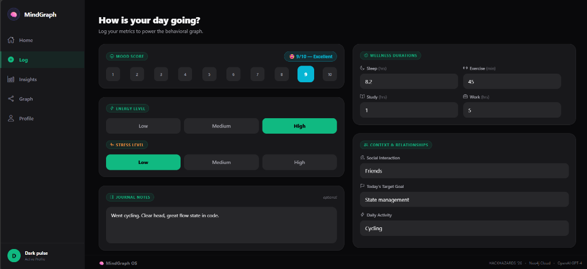
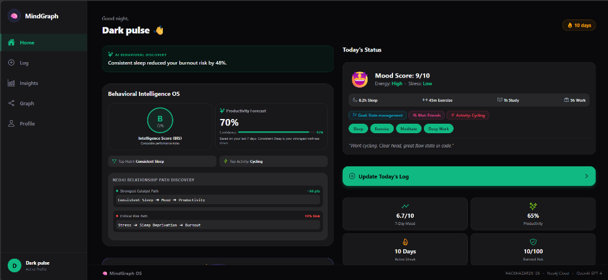
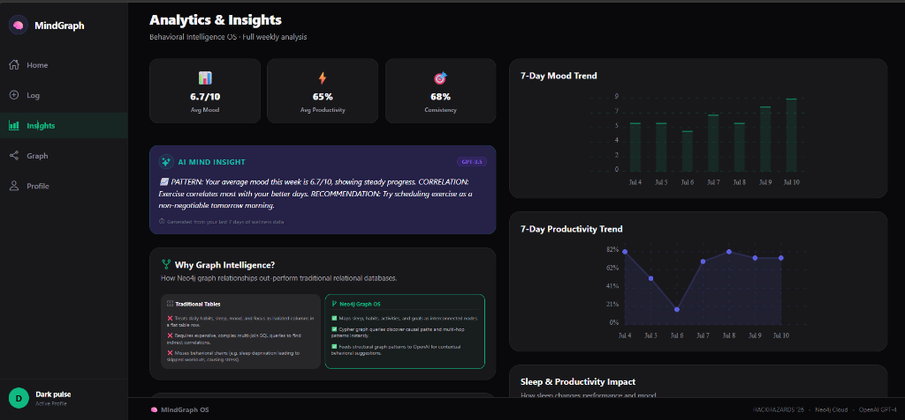
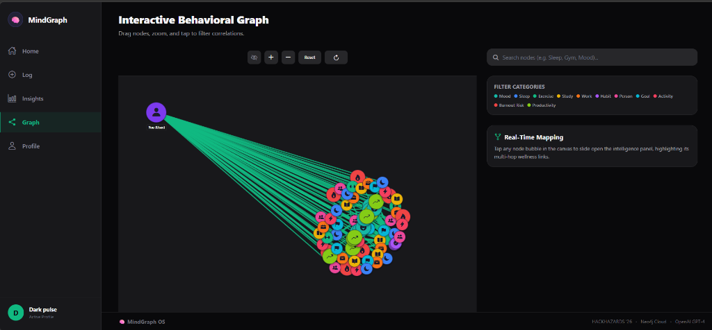
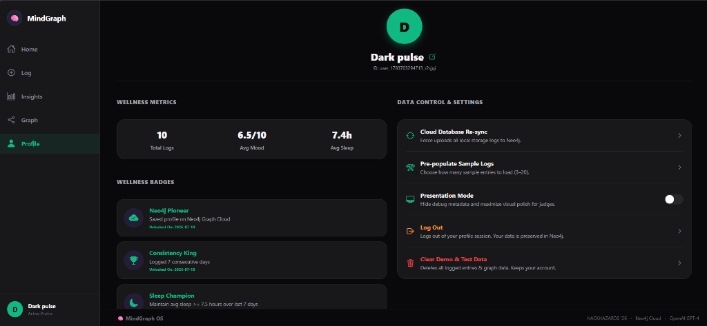

# 🚀 MindGraph

> Track your habits. Map your mind. Intercept burnout before it happens.

---

## 📌 Problem & Domain

Burnout is a silent productivity killer. Gallup reports that **77% of knowledge workers** have experienced burnout in their current role. Most professionals only recognize severe burnout after **3+ months** of progressive decline, costing the global economy **$125–$190 billion** annually in healthcare costs and lost productivity.

The root cause is structural: existing tracking apps are passive. They record isolated data columns (e.g., mood on Monday, sleep on Tuesday) but cannot see the relationship between them. Without the ability to traverse behavioral relationships, no app can actively intercept burnout before it peaks.

**Themes Selected (at least one):**
- [x] Human Experience & Productivity  
- [ ] Climate & Sustainability Systems  
- [ ] HealthTech & Bio Platforms  
- [ ] Learning & Knowledge Systems  
- [ ] Work, Finance & Digital Economy  
- [ ] Infrastructure, Mobility & Smart Systems  
- [ ] Trust, Identity & Security  
- [ ] Media, Social & Interactive Platforms  
- [ ] Public Systems, Governance and Civic Tech  
- [ ] Developer Tools & Software Infrastructure  

*(You can select multiple themes if applicable)*

---

## 🎯 Objective

MindGraph is an AI-Powered Behavioral Intelligence OS that treats your daily life like it actually is — one connected system, not separate apps. It serves remote and hybrid knowledge workers who struggle with work-life balance and are at risk of mental exhaustion.

MindGraph solves this by:
- **Low-Friction Logging**: A 30-second daily log for sleep, mood, energy, stress, and core habits.
- **Graph Traversal**: Storing behaviors as interconnected nodes in a **Neo4j AuraDB** graph, enabling instant discovery of multi-hop behavioral patterns (e.g., how skipping meditation on high-stress days impacts mood and productivity).
- **Proactive Intervention**: Calculating a real-time Burnout Risk Score and generating daily personalized AI wellness coaching insights via OpenAI GPT-3.5/GPT-4 based on active graph data.

---

## 🧠 Team & Approach

### Team Name:  
`Dark Pulse`

### Team Members:  
- **Manoj H.G (Lead)** — [GitHub](https://github.com/manoj-hg) / [LinkedIn](https://www.linkedin.com/in/manoj-h-g/) | Lead Developer  
- **Dileep MK** — [GitHub](https://github.com/DileepMK-126) / [LinkedIn](https://www.linkedin.com/in/dileep-m-k/) | Backend & Database Developer  
- **Sneha S** — [GitHub](https://github.com/sneha-s2005) / [LinkedIn](https://www.linkedin.com/in/sneha-s-5b7b08342/) | Frontend & AI Integration  
- **Chinmay J C** — [GitHub](https://github.com/Chinmay-C12331) / [LinkedIn](https://www.linkedin.com/in/chinmay-choudhari) | UI/UX & QA  

### Your Approach:
- **Why we chose this**: We wanted to build a wellness tracker that captures real human complexity. Tabular databases struggle with causal connections across various factors, so we chose Neo4j to model relationship paths directly: `(User)-[:COMPLETED]->(HabitLog)-[:ON_DAY]->(MoodEntry)`.
- **Key challenges addressed**: Handling offline/spotty internet connections while keeping the graph updated. We solved this with a **dual-save and sync pattern** using AsyncStorage locally, which dynamically falls back to local calculations if the backend server is unreachable.
- **Pivots & Breakthroughs**: Scaled local calculations for the complex Behavioral Intelligence Score (BIS), burnout risk gauge needle animation, and correlation paths so that the client UI is fully functional and responsive even offline.

---

## 🛠️ Tech Stack

### Core Technologies Used:
- **Frontend**: Expo SDK 56 & React Native 0.85, TypeScript 6.0, AsyncStorage, react-native-svg, react-native-chart-kit
- **Backend**: Node.js & Express.js REST API
- **Database**: Neo4j AuraDB (Graph Database, Cypher Query Language)
- **APIs**: OpenAI API (GPT-3.5-turbo & GPT-4)
- **Hosting**: Render.com (hosted backend API and React Native Web build hosting)

### Additional Technologies Used (Optional):
- [x] AI / ML  
- [ ] Web3 / Blockchain  
- [ ] Cyber Security  
- [x] Cloud  

---

## 🏆 Sponsored Track (Optional)

Select if your project participates in any track:

- [x] **Expo Track** – Built using Expo  
- [x] **Neo4j Track** – Uses AuraDB as primary database  
- [x] **Base44 Track** – Prototype/Final Product built using Base44  

Provide a short note on how you used the partner technology:

> **Expo**: Used to scaffold and compile our cross-platform client with strict TypeScript compliance, file-system tab routing (`expo-router`), and rich native experiences like haptic feedback (`expo-haptics`).
> 
> **Neo4j**: AuraDB stores all user sessions and logs as connected nodes. Cypher query traversals allow real-time correlation calculations to detect stress loops (e.g. `Stress -> Poor Sleep -> Burnout`).
> 
> **Base44 / Render.com**: Hosted the Express API server and static React Native Web assets, managing environment variables safely and supporting rapid deployment pipelines.

---

## ✨ Key Features

Highlight the most important features of your project:

- ✅ **30-Second Mood Logging**: Emoji-reactive mood slider (1–10), energy/stress selectors, and core habit checkboxes.
  <br/>
  

- ✅ **Real-Time Burnout Risk Gauge & BIS**: Animated SVG semi-circle gauge displaying dynamic risk zones (Safe, Caution, Risk) with a reactive needle and composite Behavioral Intelligence Score (0–100, graded A+ to D).
  <br/>
  

- ✅ **Analytics & AI Coaching Insights**: Detailed weekly mood/productivity charts, correlation cards, and personalized coach advice.
  <br/>
  

- ✅ **Interactive Graph Canvas**: Drag-and-zoom force-directed visualization of nodes and relationship paths with details overlay.
  <br/>
  

- ✅ **Profile & Achievement Badges**: Track total logs, average sleep, and unlock milestones like Neo4j Pioneer, Consistency King, and Sleep Champion.
  <br/>
  

---

## 📽️ Demo & Deliverables

- **Demo Video:** [Watch on YouTube](https://www.youtube.com/watch?v=qKqSv_zHsWQ)  
- **Live Application:** [MindGraph Web App](https://mindgraph-app.onrender.com/)  
- **Presentation Deck:** [Google Slides](https://docs.google.com/presentation/d/1N_xXT9F9tvhoEGvD2E_6Fv5OMCsMQDAE/edit?usp=sharing&ouid=109910789420155797313&rtpof=true&sd=true)  

---

## ✅ Tasks & Bonus Checklist

- [ ] All team members completed the mandatory social task  
- [ ] Bonus Task 1 – Badge sharing  
- [ ] Bonus Task 2 – Blog/article  

---

## 🧪 How to Run the Project

### Requirements:
- **Node.js** v18 or higher
- **npm** v9 or higher
- **Neo4j AuraDB** cloud database credentials
- **OpenAI API Key**

### Local Setup:
1. **Clone the Repository:**
   ```bash
   git clone https://github.com/sneha-s2005/MindGraph.git
   cd MindGraph
   ```

2. **Backend Setup:**
   ```bash
   cd backend
   npm install
   # Create a .env file with NEO4J_URI, NEO4J_USERNAME, NEO4J_PASSWORD, and OPENAI_API_KEY
   npm run dev
   ```

3. **Frontend Setup:**
   ```bash
   cd ..
   npm install
   npm run web # Open in browser at http://localhost:8081
   ```

---

## 🧬 Future Scope

List improvements, extensions, or follow-up features:

- 📈 **Wearable Integrations**: Import sleep and heart rate data from Apple Health / Google Fit.
- 🛡️ **Team Analytics**: Anonymous team dashboard for HR departments to monitor employee burnout.
- 🌐 **Custom Habits**: Allow users to track personalized habits beyond the 4 default options.

---

## 📎 Resources / Credits

- **Neo4j AuraDB** (Cloud graph database)
- **OpenAI API** (GPT coaching engine)
- **Expo SDK & React Native** (App compilation)
- **react-native-chart-kit** (Dashboard metrics visualization)

---

## 🏁 Final Words

Building this full-stack mobile-first application for the HackHazards '26 hackathon was a challenging but rewarding journey! Combining graph database analytics with mental wellness gave us a tool that feels alive and highly relevant to modern remote/hybrid teams. Special thanks to the HackHazards '26 organizers and sponsors!

---
