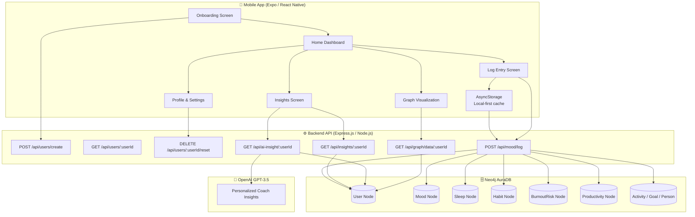
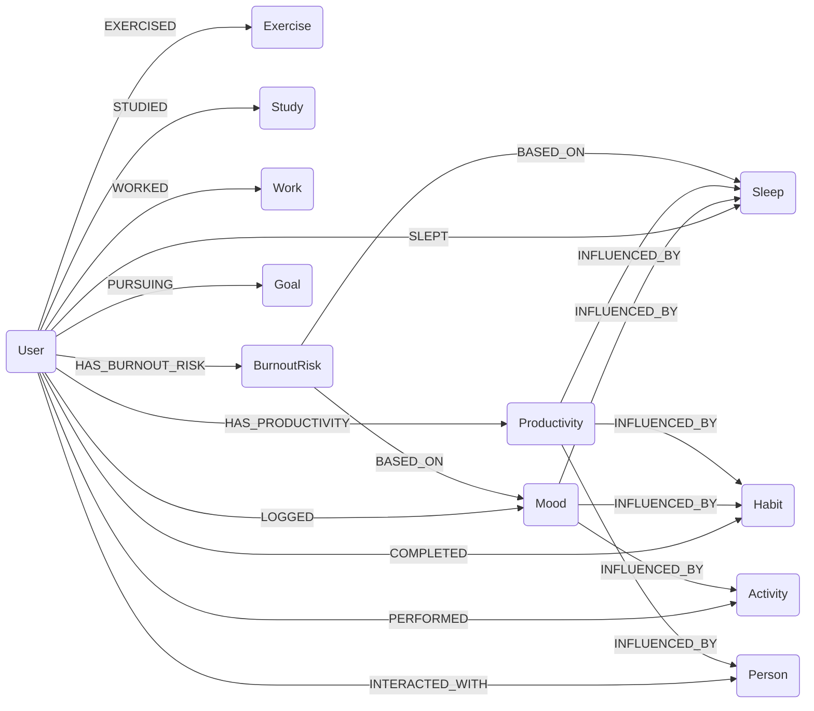

# 🧠 MindGraph

### *Your AI-Powered Behavioral Intelligence OS*

> **Track your habits. Map your mind. Intercept burnout before it happens.**

MindGraph is a cross-platform wellness application that goes beyond traditional habit tracking. By modeling your daily behaviors — mood, sleep, exercise, focus time, stress, and social interactions — as an interconnected graph in Neo4j AuraDB, MindGraph discovers the hidden behavioral patterns that drive or drain your performance. Paired with GPT-3.5 AI coaching and a real-time burnout risk engine, it gives you an early warning system for your own mental health.

Built for **HACKHAZARDS '26 · Human Experience & Productivity track**.

---


---

## 📋 Table of Contents

- [Problem Statement](#-problem-statement)
- [Solution](#-solution)
- [Key Features](#-key-features)
- [System Architecture](#-system-architecture)
- [Tech Stack](#-tech-stack)
- [Why Neo4j?](#-why-neo4j)
- [Project Structure](#-project-structure)
- [Installation & Setup](#-installation--setup)
- [Environment Variables](#-environment-variables)
- [API Documentation](#-api-documentation)
- [Usage Guide](#-usage-guide)
- [Future Enhancements](#-future-enhancements)
- [Contributing](#-contributing)
- [License](#-license)
- [Acknowledgements](#-acknowledgements)

---

## 🔥 Problem Statement

**77% of knowledge workers have experienced burnout in their current role** *(Gallup, 2023)*. Most professionals recognize severe burnout only after **3+ months** of progressive decline, costing the global economy an estimated **$125–$190 billion** annually.

The root cause is structural: **existing tracking apps are passive**. They record data in isolated columns — mood on Monday, exercise on Tuesday — but they cannot see the relationship between them. They cannot answer:

- *"Does skipping meditation on high-stress days drive my mood below 5 the next morning?"*
- *"Which single habit, if completed, most reliably predicts a productive work session?"*
- *"Am I trending toward burnout, or is this week an anomaly?"*

Without the ability to traverse behavioral relationships, no app can intercept burnout before it peaks.

---

## 💡 Solution

MindGraph models your daily life as a **property graph** — nodes for Mood, Sleep, Exercise, Study, Work, Habits, Goals, and social Persons, connected by typed relationships. Every entry you log is instantly woven into Neo4j AuraDB as a rich relationship network, not just a flat row.

**The user flow:**

```
Log daily habits (30 sec)
    ↓
Graph nodes & relationships created in Neo4j via Cypher
    ↓
Multi-hop graph queries compute burnout risk, behavioral intelligence score, and habit correlations
    ↓
GPT-3.5 reads your graph data and generates hyper-personalized AI coaching insights
    ↓
You receive an early warning + actionable advice before burnout peaks
```

The result is a **Behavioral Intelligence OS**: a system that not only records your habits but understands how they interact, predicts tomorrow's productivity, and alerts you when patterns indicate growing stress.

---

## ✨ Key Features

| Feature | Description |
|---|---|
| 🎚️ **30-Second Mood Logging** | Emoji-reactive mood slider (1–10), energy level selector, stress level, and four core habit checkboxes with haptic feedback |
| 📊 **7-Day Analytics Dashboard** | Bar and line charts for mood and productivity trends, all calculated from real logged data |
| 🔥 **Real-Time Burnout Risk Gauge** | Animated SVG semi-circle gauge with a live needle. Zones: Safe (green), Caution (yellow), Burnout Risk (red) |
| 🧬 **Behavioral Intelligence Score (BIS)** | Composite score (0–100, graded A+ to D) from mood, sleep, consistency, productivity, and stress components |
| 📈 **Tomorrow Productivity Forecast** | Predictive score with confidence percentage and contributing factors based on 3-day trends |
| 🤖 **GPT-3.5 AI Coach** | Personalized daily insight, weekly summary, behavior explanation, and habit recommendations generated from your Neo4j graph data |
| 🕸️ **Interactive Neo4j Graph Canvas** | Force-directed visualization of your behavioral node graph. Draggable nodes, zoom & pan, highlighted relationships, and a slide-out node details panel |
| 🏅 **Achievement Badges** | Streak badges, consistency badges, and behavioral milestones unlocked from real data — never auto-granted |
| 🔒 **Presentation Mode** | Hides internal user IDs and technical debug labels for clean demo presentations |
| 💾 **Offline-First Architecture** | Every entry is saved locally with AsyncStorage first; Neo4j sync is attempted afterward. The app remains fully functional offline |
| 🗑️ **Data Reset Utility** | "Clear Demo & Test Data" button wipes both local AsyncStorage and all Neo4j nodes/relationships for the user |
| 🛡️ **Strict Data-Driven Policy** | No mock data, no seeded values, no auto-analytics. All charts, scores, badges, and insights require a minimum of 3 days of logged history |

---

## 🏗️ System Architecture



### Neo4j Graph Model



---

## 🛠️ Tech Stack

| Technology | Purpose |
|---|---|
| **React Native 0.85** | Cross-platform mobile UI framework |
| **Expo SDK 56** | Managed build toolchain, routing, haptics, and splash screen |
| **Expo Router** | File-system based tab navigation |
| **TypeScript 6** | Strict type safety across all frontend source files |
| **AsyncStorage** | Local-first offline data persistence for mood entries |
| **react-native-svg** | Animated SVG burnout gauge and graph canvas rendering |
| **react-native-chart-kit** | 7-day mood and productivity bar/line charts |
| **react-native-gesture-handler** | Drag, pan, and gesture interactions on the graph canvas |
| **expo-haptics** | Tactile feedback on habit toggles and form submissions |
| **Node.js + Express.js** | REST API server with async error handling |
| **Neo4j AuraDB** | Cloud-hosted property graph database for behavioral relationship storage |
| **Cypher Query Language** | Multi-hop graph traversal for habit correlations and influence scoring |
| **OpenAI GPT-3.5 Turbo** | AI wellness coaching insight generation from structured graph data |
| **nodemon** | Hot-reload development server for the backend |
| **Render.com** | Production backend deployment with environment variable management |

---

## 🕸️ Why Neo4j?

Traditional relational databases store behavioral data as **isolated, flat rows** — mood on Monday in one table, exercise on Tuesday in another. Joining these to discover indirect correlations requires complex, expensive multi-table SQL queries that still miss multi-hop patterns.

Neo4j stores data as a **property graph**, where every behavioral event is a **node** and every causal connection is a **typed relationship**. This enables:

### Direct Graph Intelligence Examples

**Finding the most influential habit on high-mood days:**
```cypher
MATCH (u:User {id: $userId})-[c:COMPLETED {completed: true}]->(h:Habit)
MATCH (u)-[:LOGGED]->(m:Mood {date: c.date})
WHERE m.score >= 7
RETURN h.name AS habitName, count(c) AS completions
ORDER BY completions DESC LIMIT 3
```

**Sleep impact on productivity — cross-node correlation:**
```cypher
MATCH (u:User {id: $userId})-[:SLEPT]->(sl:Sleep)
OPTIONAL MATCH (u)-[:LOGGED]->(m:Mood {date: sl.date})
OPTIONAL MATCH (u)-[:HAS_PRODUCTIVITY]->(p:Productivity {date: sl.date})
WITH sl.hours >= 7 AS goodSleep, m.score AS mood, p.score AS prod
WHERE mood IS NOT NULL
RETURN goodSleep, avg(mood) AS avgMood, avg(prod) AS avgProd
```

**Activity correlation with average mood:**
```cypher
MATCH (u:User {id: $userId})-[p:PERFORMED]->(act:Activity)
MATCH (u)-[:LOGGED]->(m:Mood {date: p.date})
RETURN act.name AS name, avg(m.score) AS avgMood
ORDER BY avgMood DESC LIMIT 1
```

These queries traverse multiple hops across the graph in milliseconds — something that would require three or more JOIN operations in SQL. The result is **relationship intelligence**: understanding that skipping meditation on high-stress days forms a causal path `Stress → Poor Sleep → Burnout`.

---

## 📁 Project Structure

```
MindGraph/
│
├── 📱 src/                          # Frontend source (React Native / Expo)
│   ├── app/                         # Expo Router file-based screens
│   │   ├── _layout.tsx              # Root tab layout, UserContext provider, auth gate
│   │   ├── index.tsx                # Home dashboard (burnout gauge, BIS, forecast)
│   │   ├── log.tsx                  # Daily mood & habit entry form
│   │   ├── insights.tsx             # Analytics, charts, Neo4j wow section
│   │   ├── graph.tsx                # Interactive force-directed graph canvas
│   │   ├── profile.tsx              # User profile, badges, settings, data reset
│   │   └── onboarding.tsx           # New user registration flow
│   │
│   ├── components/                  # Shared reusable UI components
│   │   ├── MoodGauge.tsx            # Animated SVG semi-circle burnout risk gauge
│   │   ├── InsightCard.tsx          # GPT-3.5 AI insight card with shimmer loading
│   │   └── HabitCard.tsx            # Habit correlation card for the insights screen
│   │
│   ├── constants/
│   │   └── theme.ts                 # Design tokens: Colors, Spacing, Fonts
│   │
│   ├── services/
│   │   └── api.js                   # Frontend API client (createUser, logMood, getInsights, etc.)
│   │
│   └── utils/
│       └── storage.ts               # AsyncStorage CRUD (MoodEntry type, getEntries, saveEntry)
│
├── ⚙️ backend/                      # Backend API (Node.js / Express)
│   ├── index.js                     # Express app bootstrap, CORS, route mounting
│   ├── routes/
│   │   ├── users.js                 # User create, profile fetch, full data reset
│   │   ├── mood.js                  # Mood log → full Neo4j graph write (12 node types)
│   │   ├── insights.js              # 7-day analytics, BIS, forecast, habit correlations
│   │   ├── ai.js                    # GPT-3.5 coaching insight generation
│   │   └── graph.js                 # Node-link graph data for interactive visualization
│   ├── db/
│   │   └── neo4j.js                 # Neo4j driver singleton, runQuery helper, indexes
│   ├── .env                         # Environment variables (not committed with secrets)
│   ├── render.yaml                  # Render.com deployment configuration
│   └── package.json                 # Backend dependencies: express, neo4j-driver, openai
│
├── assets/                          # Static image assets
│   ├── images/                      # App icon, splash, favicon, Android adaptive icons
│   └── expo.icon/                   # iOS icon configuration
│
├── app.json                         # Expo app configuration (name, icon, splash, scheme)
├── package.json                     # Frontend dependencies and npm scripts
├── tsconfig.json                    # TypeScript strict mode config with path aliases
├── eslint.config.js                 # ESLint configuration
├── submission_materials.md          # Hackathon pitch deck content and blog post
└── README.md                        # This file
```

---

## 🚀 Installation & Setup

### Prerequisites

- **Node.js** v18 or higher
- **npm** v9 or higher
- **Expo Go** app on your mobile device (optional, for physical device testing)
- A **Neo4j AuraDB** free instance ([console.neo4j.io](https://console.neo4j.io))
- An **OpenAI API Key** ([platform.openai.com](https://platform.openai.com))

---

### 1. Clone the Repository

```bash
git clone https://github.com/your-username/MindGraph.git
cd MindGraph
```

---

### 2. Backend Setup

```bash
cd backend
```

Create a `.env` file in the `backend/` folder:

```bash
# See Environment Variables section below
cp .env.example .env   # or create manually
```

Install dependencies and start the development server:

```bash
npm install
npm run dev
```

The API server will start on **http://localhost:3000**.

Verify it is running:
```bash
curl http://localhost:3000/health
```

Expected response:
```json
{ "status": "ok", "service": "MindGraph API", "timestamp": "..." }
```

---

### 3. Frontend Setup

From the root `MindGraph/` directory:

```bash
npm install
```

Start the Expo development server:

```bash
npm start
```

Or target a specific platform:

```bash
npm run web       # Open in browser at http://localhost:8081
npm run android   # Launch on Android device or emulator
npm run ios       # Launch on iOS simulator (macOS only)
```

> **Note:** The frontend API client (`src/services/api.js`) points to `http://localhost:3000` by default. Update `BASE_URL` in that file to your Render.com deployment URL before publishing.

---

## 🔐 Environment Variables

Create a `.env` file inside the `backend/` directory with the following variables:

```env
# ──────────────────────────────────────────
# Neo4j AuraDB Credentials
# Get these from: https://console.neo4j.io
# ──────────────────────────────────────────
NEO4J_URI=neo4j+s://xxxxxxxx.databases.neo4j.io
NEO4J_USERNAME=your_neo4j_username
NEO4J_PASSWORD=your_neo4j_password
NEO4J_DATABASE=your_neo4j_database_name

# ──────────────────────────────────────────
# OpenAI API
# Get your key from: https://platform.openai.com/api-keys
# ──────────────────────────────────────────
OPENAI_API_KEY=sk-proj-xxxxxxxxxxxxxxxxxxxxxxxx

# ──────────────────────────────────────────
# Server Port
# ──────────────────────────────────────────
PORT=3000
```

> ⚠️ **Never commit your `.env` file** to version control. The `backend/.gitignore` file already excludes it.

On **Render.com**, set all of the above as environment variables in your service's dashboard (the `render.yaml` config references all required keys).

---

## 📡 API Documentation

**Base URL:** `http://localhost:3000` (development) or your Render.com service URL (production)

| Method | Endpoint | Description |
|---|---|---|
| `GET` | `/health` | Health check — returns service status and timestamp |
| `POST` | `/api/users/create` | Register a new user. Body: `{ name, email }` → returns `{ userId, name, email }` |
| `GET` | `/api/users/:userId` | Fetch user profile from Neo4j |
| `DELETE` | `/api/users/:userId/reset` | Delete ALL user nodes and relationships from Neo4j (full data wipe) |
| `POST` | `/api/mood/log` | Log a daily mood entry. Creates up to 12 node types in Neo4j with all relationships |
| `GET` | `/api/insights/:userId` | Return 7-day analytics: mood avg, productivity avg, burnout score, BIS, forecast, habit correlations, sleep impact analysis |
| `GET` | `/api/ai-insight/:userId` | Fetch real-time GPT-3.5 coaching insight generated from the user's Neo4j graph data |
| `GET` | `/api/graph/data/:userId` | Return node-link graph JSON (`{ nodes[], links[] }`) for the interactive graph visualization |

### `POST /api/mood/log` — Request Body

```json
{
  "userId": "user_123",
  "score": 8,
  "energyLevel": "High",
  "sleepHours": 7.5,
  "exerciseDuration": 45,
  "studyHours": 2,
  "workHours": 6,
  "stressLevel": "Low",
  "habits": {
    "sleep": true,
    "exercise": true,
    "meditation": false,
    "deepWork": true
  },
  "socialInteraction": "Alice",
  "goalTitle": "Complete project milestone",
  "activityName": "Morning run",
  "notes": "Felt focused and energized today."
}
```

### `GET /api/insights/:userId` — Response Shape

```json
{
  "moodAverage": 7.4,
  "productivityAverage": 72,
  "burnoutScore": 25,
  "burnoutTrend": "improving",
  "weeklyData": [...],
  "consistencyScore": 85,
  "behavioralIntelligence": { "score": 78, "grade": "B", ... },
  "productivityForecast": { "score": 80, "confidence": 86, "factors": [...], "reasoning": "..." },
  "mostInfluentialHabit": { "name": "Exercise", "impactPct": 38, "reasoning": "..." },
  "mostInfluentialActivity": { "name": "Morning run", "impactScore": 83, "strength": "Strong" },
  "topHabits": [...],
  "negativeHabits": [...],
  "sleepImpact": { "goodSleepMood": 8.1, "goodSleepProd": 76, "badSleepMood": 5.2, "badSleepProd": 44 },
  "relationships": {
    "strongestPositive": { "path": "Exercise → Mood → Productivity", "score": 70 },
    "strongestNegative": { "path": "Stress → Sleep Deprivation → Burnout", "score": 25 }
  }
}
```

---

## 📖 Usage Guide

### First-Time Setup

1. Launch the app (`npm start` → open in browser or Expo Go).
2. You'll see the **Onboarding screen**. Enter your name and email, then tap **Get Started**.
3. Your user profile is created in Neo4j AuraDB (or locally if offline).

### Logging Your First Entry

1. Tap the **Log** tab (➕ icon).
2. Set your **mood score** using the slider (1–10). The emoji updates reactively.
3. Select your **energy level** (Low / Medium / High) and **stress level**.
4. Enter **sleep hours**, **exercise duration (minutes)**, **study hours**, and **work hours**.
5. Check off your completed **habits** (Sleep 7hrs, Exercise, Meditation, Deep Work).
6. Optionally add a **social interaction**, **goal**, **activity name**, and **notes**.
7. Tap **Save Today's Entry**. The entry is saved locally and synced to Neo4j.

### Viewing Analytics

After **3 or more days** of logging, the **Insights** tab unlocks:
- 7-day mood and productivity charts
- Behavioral Intelligence Score (BIS) with grade
- Tomorrow's productivity forecast with confidence
- Most influential habit and activity (from Neo4j correlation queries)
- Sleep impact analysis (mood and productivity at 7+ hours vs. under 7 hours)
- GPT-3.5 personalized coaching card

### Exploring the Graph

The **Graph** tab renders your behavioral nodes as a force-directed canvas:
- **Drag** any node to rearrange the layout
- **Pinch or use ± buttons** to zoom in/out
- **Tap a node** to open the slide-out details panel (type, label, connections)
- Node color indicates type: Purple = User, Teal = Mood, Blue = Sleep, Green = Exercise, Red = Burnout Risk, etc.

### Resetting Your Data

In the **Profile** tab → **Settings**:
- **Clear Demo & Test Data** — prompts confirmation, then wipes AsyncStorage and all Neo4j nodes for your user, and returns you to onboarding.

---

## 🔮 Future Enhancements

| Enhancement | Description |
|---|---|
| **Push Notifications** | Daily reminder to log at a user-defined time via `expo-notifications` |
| **Cloud Sync for Multi-Device** | Sync local AsyncStorage to Neo4j on reconnect for seamless multi-device experience |
| **Team Wellness Dashboard** | Anonymous aggregated burnout metrics for HR and team leads |
| **Wearable Integration** | Import sleep and heart rate data from Apple Health / Google Fit |
| **Custom Habits** | Allow users to define and track their own habit categories beyond the 4 defaults |
| **Long-Term Trend Analysis** | 30-day and 90-day Neo4j graph traversals for extended behavioral pattern discovery |
| **Graph Export** | Export your Neo4j behavioral graph as a PNG or JSON file |
| **GPT-4 Upgrade** | Upgrade the AI coaching engine to GPT-4o for richer, more accurate insights |
| **Relationship Path Highlighting** | Tap a node and visually highlight all connected paths in the graph canvas |

---

## 🤝 Contributing

Contributions are welcome! Here's how to get started:

1. **Fork** the repository.
2. **Clone** your fork: `git clone https://github.com/your-username/MindGraph.git`
3. **Create a branch**: `git checkout -b feature/your-feature-name`
4. **Make your changes** in the appropriate `src/` or `backend/` directories.
5. **Test** your changes: run the frontend with `npm start` and the backend with `npm run dev`.
6. **Commit** with a descriptive message: `git commit -m "feat: add custom habit support"`
7. **Push** your branch: `git push origin feature/your-feature-name`
8. **Open a Pull Request** with a clear description of your changes.

### Code Standards

- TypeScript strict mode is enforced on all frontend files.
- Run `npm run lint` before committing to catch ESLint issues.
- All analytics, scores, and insights **must** be derived from real user data. No mock, seeded, or hardcoded values.
- New API routes must include an error handler and an offline/fallback response.

---

## 📄 License

This project is licensed under the **MIT License**.

See the [LICENSE](./LICENSE) file for full details.

---

## 🙏 Acknowledgements

| Resource | Role |
|---|---|
| **Neo4j AuraDB** | Free-tier cloud graph database powering the behavioral intelligence engine |
| **OpenAI GPT-3.5 Turbo** | AI model for generating personalized wellness coaching insights |
| **Expo SDK 56** | Cross-platform mobile development framework and toolchain |
| **React Native** | Core UI rendering framework |
| **react-native-chart-kit** | 7-day mood and productivity chart visualizations |
| **react-native-svg** | SVG rendering for the animated burnout gauge and graph canvas |
| **react-native-gesture-handler** | Gesture-based graph node dragging and panning |
| **expo-haptics** | Haptic feedback for habit interactions |
| **@react-native-async-storage/async-storage** | Offline-first local data persistence |
| **Render.com** | Backend deployment and environment management |
| **HACKHAZARDS '26** | Hackathon platform — Human Experience & Productivity track + Neo4j & Expo sponsor tracks |

---

<div align="center">

**Built with ❤️ for HACKHAZARDS '26**

*"Track your mind. Understand yourself."*

[](https://github.com/your-username/MindGraph)

</div>
